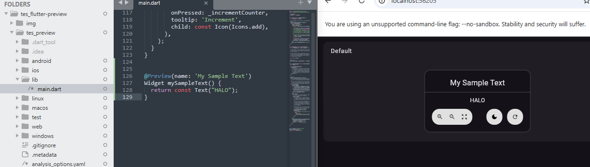
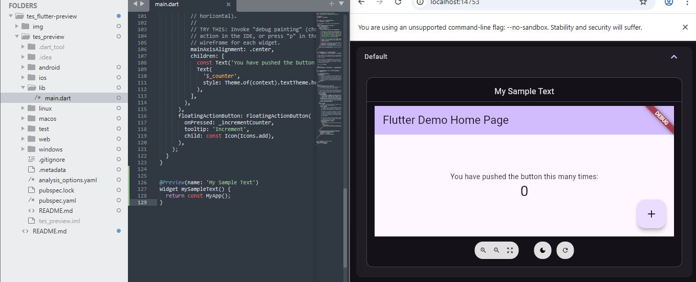
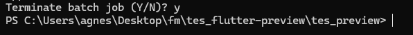

## Tes flutter preview di browser

> [!NOTE]   
> Pada praktik ini digunakan Windows PowerShell untuk menjalankan beberapa perintah CLI Flutter.   


### Implementasi   

1. Buat project baru (**e.g.** `flutter create tes_preview`)     
   ```flutter
   flutter create <nama-project>
   ```
   

2. Masuk ke folder project (**e.g.** `cd tes_preview`)  
   ```bash
   cd <nama-project>
   ```
     
   

3. Buka file main.dart di `<nama-project>\lib\main.dart`  

   


4. **Pada file `main.dart`, tambahkan import witget_previews**
   ```flutter
   import 'package:flutter/widget_previews.dart';
   ```  
   

5. **pada bagian akhir code, tambahakan** 
   ```flutter
   @Preview(name: 'My Sample Text')
   Widget mySampleText() {
     return const Text('Hello, World!');
   }
   ```   
     
   
   > Simpan perubahan file main.dart  

6. _**Jalankan flutter doctor**_    
   ```flutter
   fluuter doctor
   ``` 
    

7. _**Jalankan flutter pub get**_
   ```flutter
   flutter pub get  
   ```
      

   > Kalau ingin memperbarui ke versi terbaru dari semua dependency:
   > `flutter pub upgrade`   

8. **Jalankan preview**
    ```flutter
    flutter widget-preview start
    ```   
       
   
   Tampilan di browser (dalam praktik ini menggunakan chrome browser)  
   

9. Lakukan modifikasi, contoh:
   ```
   Text('HALO');
   ```   
   
   
   Kemudian simpan (`Ctrl+S`)  dan lihat perubahan   
   
   
   update otomatis dilakukan saat perubahan disimpan.

10. Menampilkan app  
    
    Ubah `Text('HALO');` jadi:
    ```
    MyApp();
    ```   
     Save dan lihat perubahan.   
      

   

 11. Hentikan running preview:   
     `Ctrl`+`C` kemudian `y` lalu tekan `Enter`   
       

