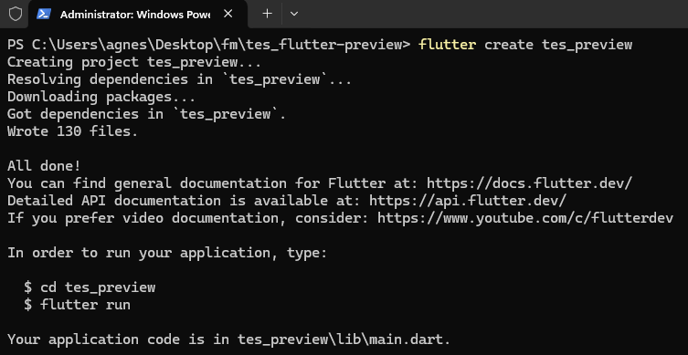
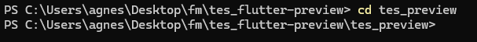
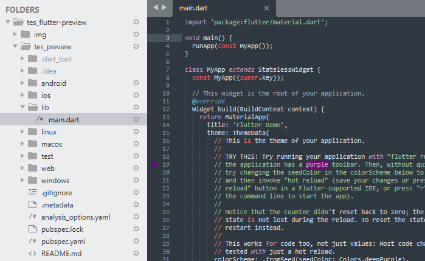
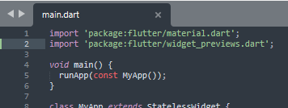
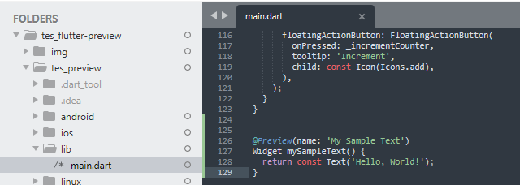
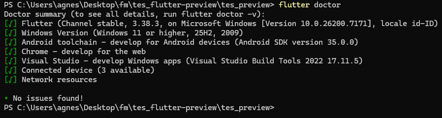
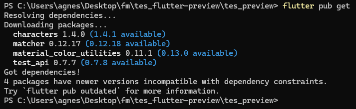
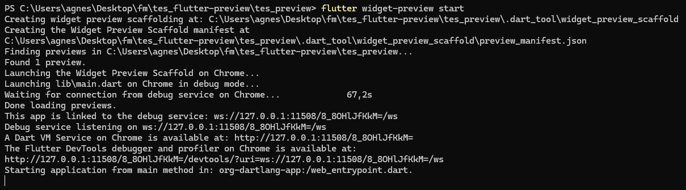
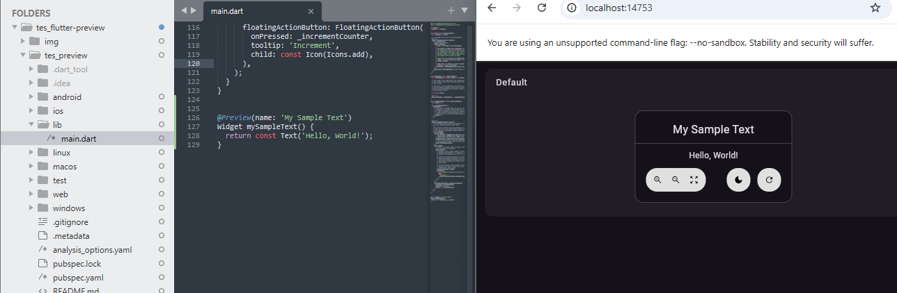

## Tes flutter preview di browser

> [!NOTE]   
> Pada praktik ini digunakan Windows PowerShell untuk menjalankan beberapa perintah CLI Flutter.   


### Implementasi   

1. Buat project baru (**e.g.** `flutter create tes_preview`)     
   ```flutter
   flutter create <nama-project>
   ```
   

2. Masuk ke folder project (**e.g.** `cd tes_preview`)  
   ```bash
   cd <nama-project>
   ```
     

3. Buka file main.dart di `<nama-project>\lib\main.dart`
   
   <a href="">
      
   </a>    

<p align="center">
  <a href="img/2.png">
    
  </a>
</p>


5. Pada file `main.dart`, tambahkan import witget_previews
   ```flutter
   import 'package:flutter/widget_previews.dart';
   ```  
   

6. pada bagian akhir code, tambahakan 
   ```flutter
   @Preview(name: 'My Sample Text')
   Widget mySampleText() {
     return const Text('Hello, World!');
   }
   ```   
     
   
   > Simpan perubahan file main.dart  

7. Jalankan flutter doctor    
   ```flutter
   fluuter doctor
   ``` 
    

8. Jalankan flutter pub get
   ```flutter
   flutter pub get  
   ```
      

   > Kalau ingin memperbarui ke versi terbaru dari semua dependency:
   > `flutter pub upgrade`   

9. Jalankan preview
   ```flutter
   flutter widget-preview start
   ```   
      
   
   Tampilan di browser (dalam praktik ini menggunakan chrome browser)  
   

11. Lakukan modifikasi, contoh:
   ```
   Text('HALO');
   ```
   Kemudian simpan (`Ctrl+S`)  dan lihat perubahan
    

    update otomatis dilakukan saat perubahan disimpan.

12. Menampilkan app  
    
    Ubah `Text('HALO');` jadi:
    ```
    MyApp();
    ```

    Save dan lihat perubahan.

 12. Hentikan running preview:

    `Ctrl`+`C` kemudian `y` lalu tekan `Enter`
    


<script src="https://cdnjs.cloudflare.com/ajax/libs/lightbox2/2.11.4/js/lightbox.min.js"></script>
<link href="https://cdnjs.cloudflare.com/ajax/libs/lightbox2/2.11.4/css/lightbox.min.css" rel="stylesheet" />
